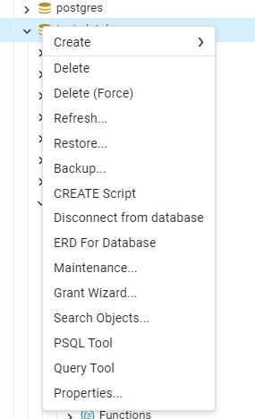
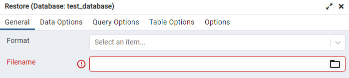
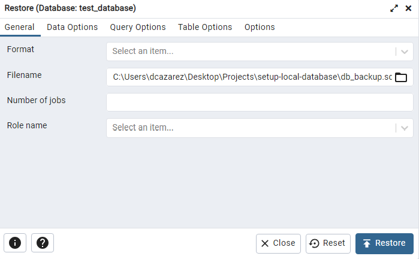

# How to setup the database to locally execute the pipeline

## Before doing the steps below, you should have cloned this git repository into a local directory or downloaded the zip and extracted it.

# Before you begin:
Make sure you have started pgAdmin and connected to the PostgreSQL 16 server. You should use the password you created during the installation process via the installation wizard.\
\
Once you are authenticated, right click on ```Databases``` and select ```Create > Database```. Create a new database and name it ```test_database```. All later documentation will rely on you having used the correct name during the setup process.

# Creating the database via a backup:
1. Right click on the created database in PostgreSQL 16 and click ```Restore```. 
2. Upload the provided  ```db_backup.sql``` file to recreate an image of the database.



3. Click restore.

# Creating the database via the Python script:
1. First, create a virtual environment for Python. This will be necessary as you will install a requirements.txt file. Run: ```python -m venv .venv``` on Windows.
2. Active the venv: ```.venv\Scripts\activate```
3. Install the requirements.txt: ```pip install -r requirements.txt```
4. Run the main.py script: ```python main.py```. During the execution you will be prompted for your password for PostgreSQL 16.